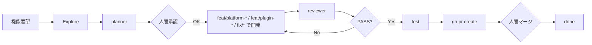

# AI 駆動開発ハーネス — 概要

> **最終更新:** 2026-06-07  
> **対象リポジトリ:** [fress-dev/fress-crm-template](https://github.com/fress-dev/fress-crm-template)（GitHub Template 有効）

Fress CRM Template における、AI エージェント向けの設定・役割分担・開発思想のまとめです。

---

## 1. このリポジトリの位置づけ

| 項目 | 内容 |
|------|------|
| ベース | [marmelab/atomic-crm](https://github.com/marmelab/atomic-crm)（MIT） |
| 目的 | 中小企業・個人事業主向け CRM の **拡張テンプレート** |
| 配布 | GitHub「Use this template」から新規リポジトリを作成 |
| 方針 | 上流コアは変更せず、**縫い目**（props / 差し替え / 追加）で拡張 |

### Git リモート

| リモート | 向き先 | 用途 |
|----------|--------|------|
| `origin` | `https://github.com/fress-dev/fress-crm-template.git` | テンプレート本体 |
| `upstream` | `https://github.com/marmelab/atomic-crm.git` | 上流の fetch・マージ |

### ブランチ戦略

| ブランチ | 役割 |
|----------|------|
| `main` | 本番相当。直接コミット・push 禁止 |
| `develop` | 開発統合。PR のマージ先 |
| `feat/platform-<内容>` | ベース・全業界共通 |
| `feat/plugin-realestate-<内容>` | 不動産プラグインのみ |
| `feat/plugin-beauty-<内容>` | 美容プラグインのみ |
| `fix/<内容>` | バグ修正（業界問わず） |

詳細・並行開発: [`docs/branch-strategy.md`](./branch-strategy.md)

テンプレートは初期 push 時に履歴を 1 コミットへ整理しているため、上流取り込みでは次が必要な場合があります。

```sh
git fetch upstream
git merge upstream/main --allow-unrelated-histories
```

カスタム差分は `src/custom/` と **新規**マイグレーションに隔離し、上流更新を継続的に取り込める状態を保ちます。

---

## 2. 開発思想

### なぜ fork + 縫い目拡張か

- 上流のバグ修正・機能追加を `upstream` から取り込める
- 自社・顧客向け差分を限定領域に閉じ込められる
- AI が「最短経路」でコアを編集し、マージ不能になる事故を防げる

### AI 駆動開発の役割分担

人間は **何を作るか・承認するか** に集中し、AI は **縫い目内の調査・計画・実装・検査** を担います。

```
調査 → 計画 → 【人間承認】→ 開発 → レビュー → テスト → PR → 【人間マージ】
```

オーケストレーション: [`AGENTS.md`](../AGENTS.md) 末尾の「## 開発フロー」/ [`docs/development-workflow.md`](./development-workflow.md)

| 原則 | 説明 |
|------|------|
| フェーズ順守 | AGENTS.md の開発フロー + フックで調査〜PR の順序を守る |
| 計画と実装を分離 | いきなりコードを書かず、`@Explore` → `@planner` で先に決める |
| 検査も別役割 | 実装者に自己レビューさせない（`reviewer` は readonly） |
| 人間承認ゲート | 計画承認とマージ承認（いずれも人間が判断） |
| 状態は git で表現 | ブランチ（`feat/platform-*` / `feat/plugin-*` / `fix/*`）と PR で進捗を管理。状態ファイルは使わない |
| 完了は機械的判定 | DoD を `reviewer` + テスト + フックで担保 |
| 失敗からルールを増やす | 同じミスが 2 回出たら `AGENTS.md` か `.cursor/rules/` に追記 |

### コア保護が最優先である理由

AI は文脈上「そのファイルを直すのが最短」と判断しがちです。ハーネスは **最短ではなく正しい経路**（props 注入・差し替え・追加）を強制します。コア変更は例外であり、必ず人間の承認後にのみ行います。

### スタック上の注意

- v1.5.0 以降は **shadcn-admin-kit** ベース（古い react-admin 前提のコードは書かない）
- UI: Shadcn UI + Tailwind / データ取得: TanStack Query / DB: Supabase + Postgres

---

## 3. ハーネス設定一覧

### ファイルマップ

| パス | 役割 |
|------|------|
| [`AGENTS.md`](../AGENTS.md) | メインエージェント向けマスター指示（コマンド・規約・DoD） |
| [`.cursor/rules/japanese-conventions.mdc`](../.cursor/rules/japanese-conventions.mdc) | **常時適用**ルール。コミット・PR・カスタムコメントは日本語 |
| [`.cursor/rules/core-protection.mdc`](../.cursor/rules/core-protection.mdc) | **常時適用**ルール。コアパス編集禁止 |
| [`.cursor/agents/planner.md`](../.cursor/agents/planner.md) | 設計専任サブエージェント |
| [`.cursor/agents/reviewer.md`](../.cursor/agents/reviewer.md) | レビュー専任サブエージェント |
| [`.cursor/agents/db-migrator.md`](../.cursor/agents/db-migrator.md) | DB マイグレーション専任サブエージェント |
| [`.cursor/rules/development-workflow.mdc`](../.cursor/rules/development-workflow.mdc) | ブランチ戦略・開発フロー順守（常時適用） |
| [`.cursor/hooks.json`](../.cursor/hooks.json) | shell ゲート（main 直接 commit/push ブロック、ブランチ命名検証） |
| [`docs/branch-strategy.md`](./branch-strategy.md) | 業界プラグイン向けブランチ命名・並行開発 |
| [`.claude/skills/frontend-dev/`](../.claude/skills/frontend-dev/) | フロント実装のドメイン知識 |
| [`.claude/skills/backend-dev/`](../.claude/skills/backend-dev/) | バックエンド（Supabase）のドメイン知識 |
| [`.claude/skills/delete-initial-resource/`](../.claude/skills/delete-initial-resource/) | 組み込みリソース削除手順 |
| [`src/custom/`](../src/custom/) | **すべての自社拡張コード**の置き場（現状 `.gitkeep` のみ） |
| [`scripts/sync-local-env.sh`](../scripts/sync-local-env.sh) | ローカル Supabase キーを `.env` に反映 |
| [`scripts/publish-template.sh`](../scripts/publish-template.sh) | テンプレートの初回 GitHub 公開用 |
| [`.github/workflows/check.yml`](../.github/workflows/check.yml) | CI: Lint / Typecheck / Test / Build |
| [`.github/workflows/deploy.yml`](../.github/workflows/deploy.yml) | デプロイワークフロー |

### 触ってよい / 触ってはいけない

**触ってはいけない（コア）**

- `src/root/**`
- `src/components/**` および各既存リソースフォルダ（contacts / companies / deals / notes など）の **既存ファイル**
- 既存の `supabase/migrations/*`（編集・削除禁止）

**触ってよい**

- `src/custom/**`（新規追加すべて）
- `src/App.tsx`（`<CRM>` への props 注入・カスタムコンポーネント登録のみ）
- `supabase/migrations/` への **新規**タイムスタンプ付きファイル追加

### 拡張の優先順位

1. `<CRM>` の props / 設定
2. コンポーネント差し替え（props 注入）
3. カスタムフィールド / カスタムページの追加
4. Supabase（新規テーブル・ビュー・RLS・Edge Function）
5. 上記不可時のみコア変更（**要人間承認**）

### コミット時の Git  identity（推奨）

Contributors 表示を `fress-dev` に揃えるため、このリポジトリでは次を推奨します。

```sh
git config user.name "fress-dev"
git config user.email "fress-dev@users.noreply.github.com"
```

`gh auth login` のアカウントと commit Author は別です。push 権限と Contributors 表示は一致しません。

### 言語・表記規約

| 対象 | 言語 |
|------|------|
| コミットメッセージ（件名・本文） | 日本語 |
| PR（タイトル・本文） | 日本語 |
| `src/custom/**`、新規マイグレーション等のコメント | 日本語 |
| 変数・関数名・ファイル名 | 英語（既存慣習） |
| コア既存ファイルのコメント | 変更しない（英語のまま） |

詳細: [`AGENTS.md`](../AGENTS.md) の「## 言語・表記規約」/ [`.cursor/rules/japanese-conventions.mdc`](../.cursor/rules/japanese-conventions.mdc)

---

## 4. エージェント一覧

### メインエージェント（Cursor チャット）

通常の実装・調査・コミット準備を行います。`AGENTS.md` と `core-protection` ルールを常に参照します。実装時は `.claude/skills/` のドメイン知識も活用します。

### サブエージェント（`.cursor/agents/`）

Cursor が自動認識する専門役です。**`.cursor/rules` は継承しない**ため、各ファイル内にコア保護の要点を直接記載しています。

調査はビルトインの **@Explore** を使う（専用サブエージェントは置かない）。

| 名前 | 役割 | 書き込み | フェーズ | 言語 |
|------|------|----------|----------|------|
| **planner** | 縦切り単位の実装計画（縫い目ベース） | しない（readonly） | 計画 | 出力は日本語 |
| **reviewer** | コア侵食・DoD・言語規約を検査（差分モード） | しない（readonly） | レビュー | 出力は日本語 |
| **db-migrator** | 追加専用マイグレーション・RLS・型再生成 | する | 開発（DB 時） | SQL コメントは日本語 |

PR 作成は **メインエージェント** が `gh pr create --base develop` で行う。

#### planner の出力

- 縦切りタスク分解（1 タスク＝1 縫い目）
- 各タスクの手段（props / 差し替え / カスタムページ / Supabase 追加）
- DB 変更があれば `db-migrator` へ渡せる粒度の概要
- コア変更が必要なら「要承認事項」として明示（勝手に計画へ組み込まない）

#### reviewer の検査観点

- **コア保護:** 禁止パスへの diff があれば即 FAIL
- **拡張パターン:** 新規コードが `src/custom/` に閉じているか
- **CRM 固有:** RLS、`security_invoker`、PII ログ漏洩
- **言語規約:** カスタム側コメント・コミット・PR が日本語か。コアコメントの日本語化編集がないか
- **日本向け i18n:** 請求・適格請求書・消費税・屋号・敬称・住所形式など
- **データ取得:** TanStack Query の作法、古い react-admin API の不使用
- **DoD:** `make test` / `make test-e2e` / `tsc` / コア diff 空

出力は `判定: PASS / FAIL` 形式。修正は行わず指摘のみ。

#### db-migrator のルール

- **追加専用（additive-only）** — 既存マイグレーションの編集・削除禁止
- 新規ファイル命名: `YYYYMMDDHHmmss_description.sql`
- 新規テーブルには必ず RLS
- ビューには `security_invoker = true`
- 破壊的 SQL はコメントアウトし「要承認」として報告
- 適用後に型再生成（`supabase gen types typescript --local` 等）

**呼び出し例**

```
@planner 見積もり機能を追加したい。コアを触らない計画を立てて。
@db-migrator quotes テーブルと RLS を追加して。
@reviewer 今の差分をレビューして。
```

### Claude Skills（`.claude/skills/`）

メインエージェントが実装時に参照するドメイン知識です。

| スキル | 内容 |
|--------|------|
| **frontend-dev** | React / shadcn-admin-kit / フォーム・一覧・詳細・フィルタの作法 |
| **backend-dev** | マイグレーション・RLS・Edge Functions・dataProvider の判断基準 |
| **delete-initial-resource** | contacts / companies / deals / tags / tasks の安全な削除 |

### 典型フロー



---

## 5. Definition of Done

作業完了の宣言前に、すべて満たすこと。

1. `make test` が緑
2. `make test-e2e` が緑
3. `npx tsc --noEmit` が通る
4. コア保護パスの `git diff` が空
5. 変更理由を 1〜2 行で説明できる（なぜ縫い目側で実現できたか）

`reviewer` と CI（`.github/workflows/check.yml`）の双方で品質を担保します。

---

## 6. ローカル開発環境

### 初回セットアップ

```sh
make install
make start-supabase          # または make start
./scripts/sync-local-env.sh  # 実キーを .env に反映
make start-app               # Supabase 起動済みなら
```

### 主な URL

| サービス | URL |
|----------|-----|
| アプリ | http://localhost:5173/ |
| 初回サインアップ | http://localhost:5173/#/sign-up |
| Supabase Studio | http://127.0.0.1:54323/ |

### `.env` の扱い

- リポジトリ内の `.env*` は **プレースホルダー**（GitHub Push Protection 対応）
- `sync-local-env.sh` が `npx supabase status -o env` から実キーを書き込む
  - 対象: `.env.development`、`supabase/functions/.env`
  - e2e 用（`.env.e2e`）は `make start-e2e` 後に再実行
- **実キー入り `.env` は commit しない**

### よく使うコマンド

| コマンド | 用途 |
|----------|------|
| `make start` | Supabase + Vite をまとめて起動 |
| `make stop` | ローカルスタック停止 |
| `make test` | ユニットテスト |
| `make test-e2e` | e2e テスト（UI モード） |
| `make supabase-migrate-database` | マイグレーション適用 |
| `npm run lint` | ESLint |

---

## 7. テンプレートから新規プロジェクトを作る

1. GitHub で [fress-crm-template](https://github.com/fress-dev/fress-crm-template) を開く
2. **「Use this template」** から新規リポジトリを作成
3. `origin` を自分のリポジトリ URL に設定
4. `upstream` を `marmelab/atomic-crm` に追加（未設定の場合）

```sh
git remote add upstream https://github.com/marmelab/atomic-crm.git
```

5. 上記「ローカル開発環境」の手順で起動

---

## 8. ハーネスの育て方

エージェントが繰り返すミスは、次のいずれかに **短く具体的なルール** として追記します。

| 追記先 | 向いている内容 |
|--------|----------------|
| `AGENTS.md` | プロジェクト全体の方針・DoD・コマンド |
| `.cursor/rules/*.mdc` | 常時適用のガードレール |
| `.cursor/agents/*.md` | サブエージェントの検査基準・出力形式 |

良いルール: 「Stripe Webhook を扱うときは署名検証を必須とする」  
悪いルール: 「決済まわりで気をつける」

---

## 9. 関連リンク

- テンプレート: https://github.com/fress-dev/fress-crm-template
- 上流: https://github.com/marmelab/atomic-crm
- 拡張ルール: [`AGENTS.md`](../AGENTS.md)
- 製品ドキュメント（上流）: [`doc/`](../doc/)
